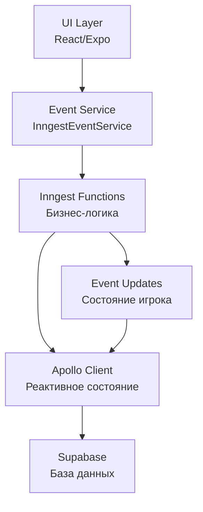

# 🕉️ НейроЛила - Игра Самопознания

> *"Путь к просветлению начинается с одной команды"* ✨


## 🌟 **Супер-Быстрый Старт**

### 💎 **Одна Команда - Вся Магия:**
```bash
bun dev
```

**Что происходит:**
- 🔮 Inngest сервер запускается автоматически
- 🌐 Веб-приложение открывается в браузере  
- 🎮 Игра готова к использованию!

---

## 🎯 **Что Это?**

**НейроЛила** - это современная веб-версия древней индийской игры самопознания, построенная на:

- **🏗️ Event-Driven Architecture** с Inngest
- **⚡ React Native + Expo** для кроссплатформенности
- **🔄 Apollo Client** для реактивного состояния  
- **🗄️ Supabase** для базы данных
- **🧪 Полное тестирование** с Vitest + @inngest/test

---

## 🚀 **Команды для Всех**

### **Разработка:**
```bash
# Всё в одной команде (рекомендуется!)
bun dev

# Только веб-приложение
bun run web

# Только Inngest сервер  
bun run inngest:dev

# Помощь по командам
bun run help
```

### **Тестирование:**
```bash
# Быстрый тест Inngest
bun test __tests__/inngest/minimal.test.ts

# Все Inngest тесты
bun run test:inngest

# Тесты в watch режиме
bun run test:inngest:watch
```

### **Мобильные платформы:**
```bash
# iOS симулятор
bun run ios

# Android эмулятор
bun run android

# Development client
bun run dev:client
```

---

## 🏗️ **Архитектура**



### **Основные Принципы:**
- 🎯 **UI** только отправляет события, не содержит бизнес-логику
- ⚡ **Inngest** обрабатывает всю игровую логику асинхронно
- 🔄 **Apollo** реактивно обновляет интерфейс
- 🗄️ **Supabase** надежно хранит данные

---

## 📁 **Структура Проекта**

```
NeuroLeelaExpo/
├── 🎨 app/                    # Expo Router + UI компоненты
├── 🧩 components/             # Переиспользуемые компоненты  
├── ⚡ inngest/               # Event-driven бизнес-логика
│   ├── client.ts             # Inngest клиент и типы
│   └── functions/            # Все игровые функции
├── 🔧 services/              # Вспомогательные сервисы
├── 🧪 __tests__/             # Комплексные тесты
│   └── inngest/              # Тесты бизнес-логики
├── 📚 DEV_GUIDE.md           # Подробный гайд разработчика
└── 🏗️ current_task.mdc       # Текущие задачи проекта
```

---

## 🎮 **Как Играть**

1. **Запустите проект:** `bun dev`
2. **Браузер откроется автоматически**
3. **Зарегистрируйтесь или войдите**
4. **Нажмите на кубик** для броска
5. **Следуйте путешествию** по планам самопознания
6. **Пишите отчеты** о своих открытиях

---

## 🛠️ **Установка**

### **Требования:**
- Node.js 18+
- Bun (рекомендуется) или npm
- Git

### **Быстрая установка:**
```bash
# Клонировать репозиторий
git clone <repo-url> NeuroLeelaExpo
cd NeuroLeelaExpo

# Установить зависимости
bun install

# Настроить окружение
cp .env.example .env
# Заполните переменные окружения

# Запустить!
bun dev
```

---

## 🧪 **Тестирование**

Проект покрыт комплексными тестами:

- ✅ **processDiceRoll** - Логика бросков кубика
- ✅ **processReport** - Обработка отчетов игроков
- ✅ **playerStateHandler** - Управление состоянием
- ✅ **Минимальные тесты** - Проверка инфраструктуры

**Подробности:** См. `__tests__/inngest/README.md`

---

## 💝 **Для Новичков**

> *"Не бойтесь кода! Это как LEGO для взрослых - всё собирается из простых блоков."* 🧱

### **Если вы новичок в разработке:**

1. **Установите Bun:** https://bun.sh/
2. **Откройте терминал** (черное окошко с текстом)
3. **Скопируйте команды** из этого README
4. **Запустите `bun dev`** и наслаждайтесь!

### **Если что-то сломалось:**
- Нажмите `Ctrl+C` чтобы остановить всё
- Запустите `bun dev` заново
- Напишите в чат поддержки 💬

---

## 🤝 **Участие в Проекте**

Приветствуем любой вклад:

- 🐛 **Баг-репорты** через Issues
- ✨ **Новые функции** через Pull Requests  
- 📚 **Улучшения документации**
- 🎨 **UI/UX предложения**

---

## 📜 **Лицензия**

MIT License - используйте как хотите, просто оставьте упоминание! 🙏

---

## 🔗 **Полезные Ссылки**

- 📚 **[Подробный DEV_GUIDE.md](DEV_GUIDE.md)** - Полное руководство
- 🏗️ **[current_task.mdc](current_task.mdc)** - Текущий статус проекта
- 🧪 **[Тесты](/__tests__/inngest/)** - Документация по тестированию
- 🔮 **Inngest Dashboard:** http://localhost:8288
- 🌐 **Веб-приложение:** http://localhost:8081

---

*🕉️ "В каждой строке кода - мудрость. В каждом событии - возможность. В каждом тесте - уверенность в пути."* ✨

**Добро пожаловать в НейроЛила! Пусть ваш код будет чист, а баги - просветлены.** 🚀
